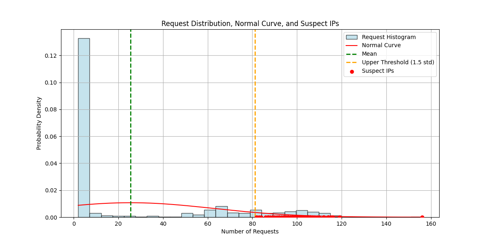
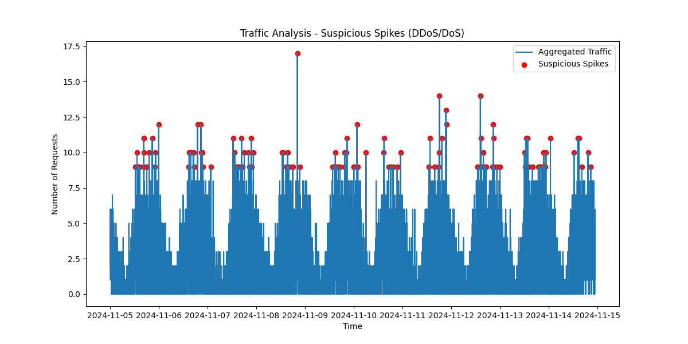

# Technical Report - Dataset Analysis and Investigation of Anomalies in Network Traffic

## Step 01 - Dataset Analysis

**Number of records analyzed:** 30,000  
**Main columns in the dataset:**
- **ClientIP:** IP address of the client making the request.
- **ClientRequestHost:** Host of the request made.
- **ClientRequestMethod:** HTTP method used (GET, POST, etc.).
- **ClientRequestURI:** URI of the requested resource.
- **EdgeStartTimestamp:** Timestamp when the request started.
- **ClientCountry:** Country of origin of the client.
- **ClientSrcPort:** Source port used by the client.
- **ClientRequestBytes:** Size of the request in bytes.
- **ClientRequestUserAgent:** User agent used in the request.

---

## Step 02 - Investigation of Network Traffic Anomalies

The objective of this step was to identify possible anomalies in the network traffic, such as request spikes by IP, suspicious geographic patterns, and unusual user agents.

### 1. Identification of IPs with Anomalous Traffic

To identify IPs with abnormal behavior, the script [request_counts.py](./scripts/request_counts.py) was developed, which lists the number of requests from each external IP. This script generates the report [request_counts.csv](./csv/request_counts.csv), which is then used by the script [standard_curve.py](./scripts/standard_curve.py) to analyze the volume of requests per IP and generate a graph of the standard curve, helping to identify IPs with higher-than-normal request numbers. The script also exports a CSV report with these suspicious IPs [suspect_ips_above_threshold.csv](./csv/suspect_ips_above_threshold.csv).  
As a result of the `standard_curve.py` script, we have the following graph:

**Results:**  
- **Number of out-of-standard IPs:** 62  
- **Criteria used:** IPs exceeding 1.5 times the standard deviation in request volume.  

**Graph:**  
The generated graph shows significant traffic spikes in short time intervals, indicating possible automated behavior.

---

### 2. Temporal Analysis of Traffic

Based on the identified pattern, a cross-analysis of the traffic over time was performed using the script [traffic_spike_detection.py](./scripts/traffic_spike_detection.py). This script gives us the following graph:

**Observations:**  
- The traffic spikes have clear periodicity, suggesting automation or bot use.  
- There is a concentration of requests at specific times, reinforcing the hypothesis of orchestrated attacks.

**Preliminary Conclusion:**  
The data indicates activities consistent with Denial of Service (DoS) attacks, possibly carried out by bots programmed to act at pre-determined times.

---

### 3. Analysis of User Agents

The user agents (User Agents) were analyzed using the script [clientRequestsAgent.py](./scripts/clientRequestsAgent.py). A threshold of 80 requests (approximately 1.5 standard deviations from the standard curve) per User Agent was set to classify suspicious frequencies.  

This script generates the report [suspicious_user_agents.csv](./csv/suspicious_user_agents.csv), which contains information about the most used user agents in the requests, allowing us to reach the following results:

**Results:**  
- Outdated user agents were identified, such as:  
  - `"Windows 98"`, `"Windows NT 5.0"`, `"Windows 98; mni-IN"`  
  - Older browsers such as `"MSIE 8.0"`, `"Opera/8.24"` and `"Opera/9.21"`.  
- **Highlight:** The user agent `"Mozilla/5.0 (Windows; U; Windows 98)"` was responsible for **4,173 requests**, a considerably high number.  

**Interpretation:**  
The presence of such outdated user agents in 2024 suggests spoofing to mask the origin of the requests and avoid detection.

---

## Possible Types of Attacks Identified

Based on the analyzed and observed patterns, three main hypotheses were raised:

### 1. HTTP Flood Attack  
- **Description:** Mass sending of legitimate HTTP requests (GET or POST), simulating real user traffic.  
- **Evidence:**  
  - Anomalous patterns in user agents.  
  - Requests concentrated on specific URIs.

### 2. Amplification Attack  
- **Description:** Use of suspicious IPs to amplify traffic, where the responses are significantly larger than the requests.  
- **Evidence:**  
  - IPs with high traffic volume.  
  - Periodic spikes in short intervals.

### 3. Reconnaissance or Preparation for DDoS  
- **Description:** Initial phase to map vulnerabilities or adjust traffic volume before the main attack.  
- **Evidence:**  
  - Identification of URIs and user agents as potential targets.  
  - Identity spoofing to avoid blocking.

---

## Final Considerations

The conducted analyses allow the following conclusions:  
1. **Identity Spoofing:** The presence of outdated user agents and IPs from various regions reinforces the hypothesis of spoofing to hinder detection.  
2. **Consistency in Patterns:** Anomalous temporal patterns indicate automated activity.  
3. **Distributed Attack:** The use of multiple IPs suggests a distributed attack typical of a DDoS.
